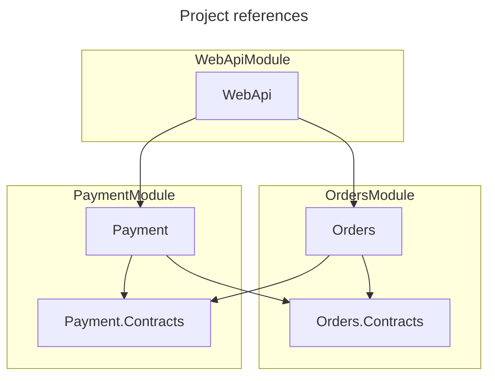
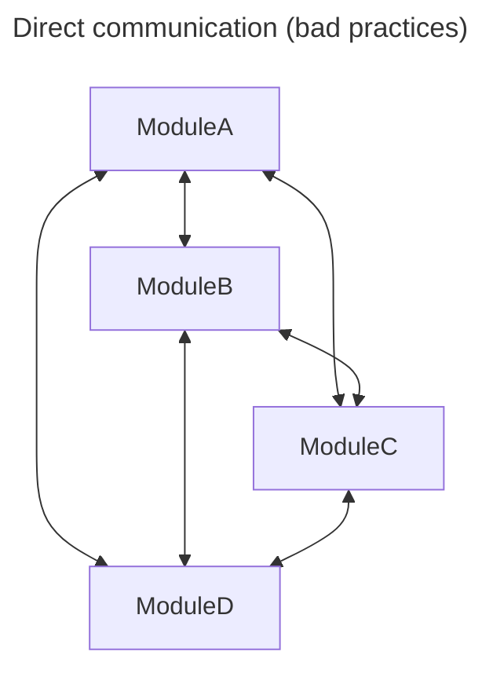
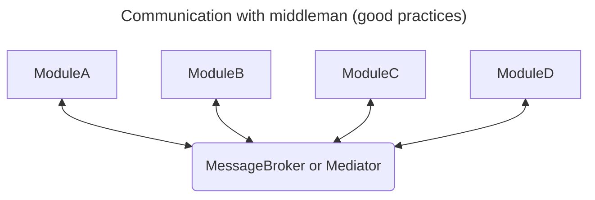

---
tags:
  - Architecture
  - Modular
---

# Monolith

A **modular monolith** has many overlapping advantages with [microservices](microservice.md). However, in a monolith architecture it is a lot easier to bypass the modularity and therefore creating a big ball of mud. One way to enforce the modularity is by writing architectural [fitness functions](../01-concepts/architecture.md#Fitness%20tests).

> The hardest thing about building modular monoliths is keeping them modular.

> One of the major benefits of a modular monolith is how easy it is to share code. But that same ease is also their biggest flaw. Ironically, code sharing becomes the main vector of contamination.

Monolith and microservices should not be on a black-white scale but rather on a continuous scale. If we have a modular monolith we can extract specific modules into services for optimization or because they have specific needs (such as individual deployable).

## Concerns

- Long compilation times.
- Long-running test.
- Deployment to production takes a long time.
	- Single deployment unit.
- Limited language agnosticism.
- Centralized development.

### Modular

The module’s independence is determined by three main factors:

- number of dependencies (to other modules) - could be reduced e.g. with a *mediator*
- strength of dependencies (how chatty is the module with another one) - should these modules be *merged*?
- stability of the modules on which the module depends on (how many modules need a change when I change my module?) - *merge*?

Technical layers are often used as "modules" but this is very bad in regards to "stability" since a new feature usually needs a change in all modules (UI, API, Business, DB). [Vertical Slice](vertical-slice.md) seems more reasonable.

Module must have **well-defined interface** (a contract). We only want to have one "arrow" from Module A -> Module B.

A modular component is a building block of the application that has a well-defined role and responsibility in the system and a well-defined set of operations.

It is often difficult to enforce modularity in monolith and it often relies on discipline. A concrete solution could look like this.

### Example

The best way to **separate** modules in .Net is **by** creating **projects**  and keep everything where possible *internal* or *private*. We usually need at least one WebApi project (executable) and could then add projects (class libraries) for each module. A module would contain simple interfaces for the WebApi to use (such as ServiceCollectionExtensions to register services in the program as well as the endpoint definitions such as controller or minimal api definition). In addition we would add a Module.Contracts project for a clean communication interface. The WebApi can reference the module, all other modules can only reference the Contracts module. 
We can even build the modules in a way that they can run on their own. E.g.: Each module has an executable Api where we reuse the ServiceCollectionExtensions but mock external modules. 

For inter-module-communication we would introduce something like a mediator (easier) or message bus (more complex) to still have a clear separation.

**Example**

### Notes

Get and Updates alike can be done via messages (I can also have a "GetBlaBlaRequestEvent" which produces an "BlaBlaResponseEvent" in another system).
Complexity increases drastically again if we do it like that (separate projects, strict contracts, message broker or mediator, async everything, ... ) and we should decide if that's worth it but it prevents a "big ball of mud" and is less complex then microservices.

# Related

[microservice](microservice.md)
[vertical-slice](vertical-slice.md)