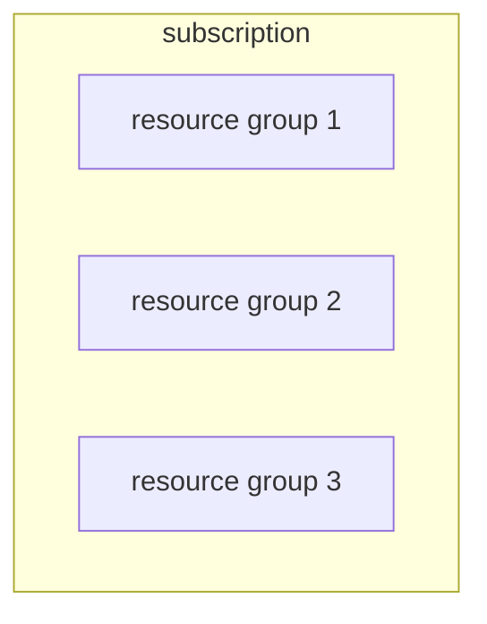

---
tags:
  - WIP
  - Azure
---

## Subscription

A subscription can have multiple resource groups 

## Resource Group

Contain things that share a common lifecycle. They are created together, they run together, they get provisioned together. We can apply policies, RBAC, budget on resource group level

- App
- Workload 
- VM
- Storage account
- DB
- ...

Resource group cannot contain another resource group (no nesting)