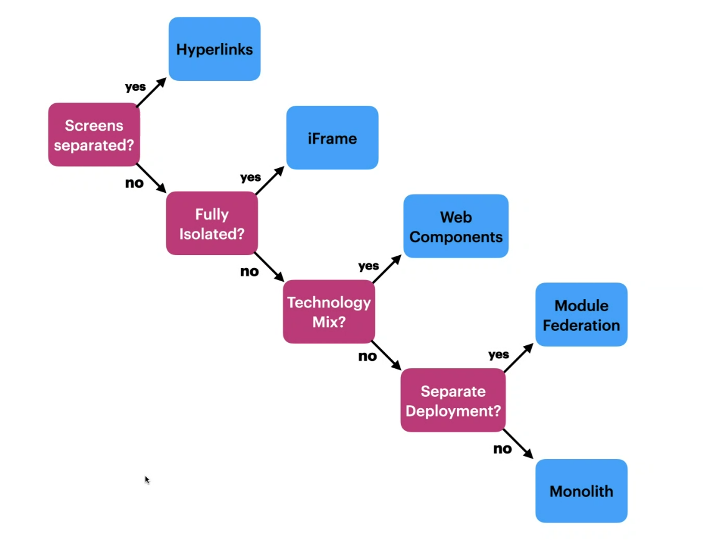

---
tags:
  - Architecture
  - Distributed-System
---
# Microservices 

> [!TIP] Consider a modular monolith before creating a microservice architecture.

> [!TIP] It's usually best to start with something monolithic and modular, and only decomposing in response to genuine need.

- Do not make long service dependencies (A->B->C->D->...). This will eventually fail (Bad performance and bad availability).
	- This can and has to be solved with data duplication (no changes though)
	- Make a rule that only one hop is allowed A->B 

If the same team that created the *"monolithic big ball of mud"* moves to a microservices architecture, there is a high chance they will create a *"distributed big ball of mud"*.

> [!INFO]
>  Microservices are not the solution to get rid of a "big ball of mud", modularization is. Microservices are just one way how we can enforce better modularization

A microservices can offer a lot of good properties such as:

- High cohesion
- Low coupling
- Focussed on business capability
- Bounded context or aggregate
- Encapsulated data

but so does a modular [monolith](monolith.md)!
Microservices excel in other areas such as:

- Individually deployable
- Individually upgradeable
- Individually replaceable
- Individually scalable
- Heterogeneous technology stack

We should consider microservices only if we need these characteristics. 
If we have a good modular monolith but some parts of the application need those characteristics we can always extract those and opt for a modular monolith with some additional services around it.

> [!WARNING] Microservices **need** there own isolated persistence (DB)

# Micro frontend (MFE)

MFE is recommended for teams that require applications to be deployed independently. It is important to consider the cost of MFEs and decide whether it makes sense for your own teams.

With MFE architecture, a large application is split into:

1. A single **Host** application that references external...
2. **Remote** applications, which handle a single domain or feature.

## Decision Tree for MFEs

# Related

[self-contained systems](self-contained-systems.md)
[monolith](monolith.md)
[vertical-slice](vertical-slice.md)
