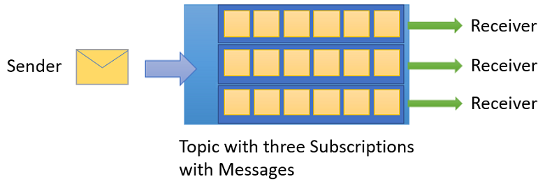

# Service Bus Messaging 

## Queue

> [!INFO] Title
> An information callout from Obsidian
> inspired by the syntax from the Microsoft Docs

---

>[!tip] Use when there is a need to pass the message in the one-to-one system. 

Messages in queues are ordered and timestamped on arrival.

 
## Topic
 > **💡 Tip:** Use when there is a need to send the message to multiple systems.

Topics can have multiple, independent subscriptions, which attach to the topic and otherwise work exactly like queues from the receiver side.

