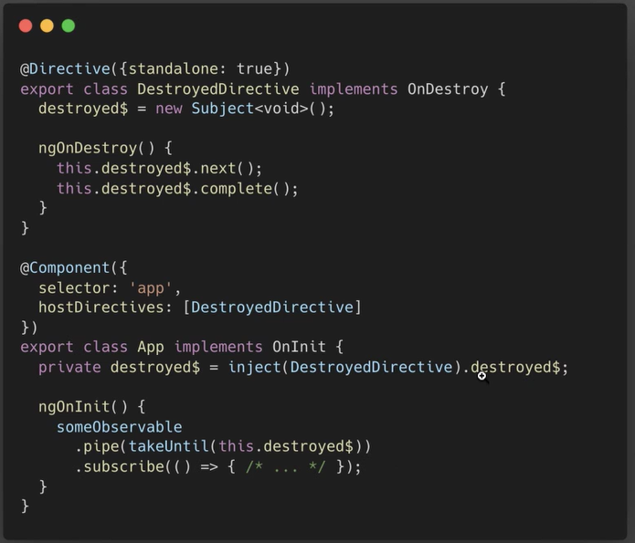

---
tags:
  - frontend
---

# Some useful code snippets

## JS

<details>
    <summary>js - nameof</summary>


	```typescript
	// very simple nameof version to ensure type safety. usage: nameof<User>(‘name’)
	export function nameof<T>(key: keyof T, instance?: T): keyof T {
	  return key;
	}
	```
	
</details>

<details>
  <summary>js - guid</summary>

```typescript
export function guid() {
  function s4() {
    return Math.floor((1 + Math.random()) * 0x10000)
      .toString(16)
      .substring(1);
  }

  return s4() + s4() + "-" + s4() + "-" + s4() + "-" + s4() + "-" + s4() + s4() + s4();
}
```

</details>

## rxjs

<details>
  <summary>rxjs - unsubscribe on destroy</summary>



</details>

<details>
  <summary>rxjs - untilDestroy - operator</summary>

```typescript
import { MonoTypeOperatorFunction, Observable } from "rxjs";
import { takeUntil } from "rxjs/operators";

// create a symbol identify the observable I add to
// the component so it doesn't conflict with anything.
// I need this so I'm able to add the desired behaviour to the component.
export const destroy$ = Symbol("destroy$");

/**
 * An operator that takes until destroy it takes a components this a parameter
 * returns a pipeable RxJS operator.
 */
export const untilDestroy = <T>(component: any): MonoTypeOperatorFunction<T> => {
  const orignalDestroy = component.ngOnDestroy;
  if (orignalDestroy == null) {
    // Angular does not support dynamic added destroy methods
    // so make sure there is one.
    throw new Error("untilDestroy operator needs the component to have an ngOnDestroy method");
  }
  if (component[destroy$] === undefined) {
    // only hookup each component once.
    addDestroyObservableToComponent(component);
  }

  // pipe in the takeUntil destroy$ and return the source unaltered
  return takeUntil<T>(component[destroy$]);
};

/**
 * @internal
 */
export function addDestroyObservableToComponent(component: any) {
  component[destroy$] = new Observable<void>((observer) => {
    // keep track of the original destroy function,
    // the user might do something in there
    const orignalDestroy = component.ngOnDestroy;
    // replace the ngOndestroy
    component.ngOnDestroy = () => {
      // fire off the destroy observable
      observer.next();
      // complete the observable
      observer.complete();
      // and at last, call the original destroy
      orignalDestroy.call(component);
    };
    // return cleanup function.
    return (_: any) => (component[destroy$] = undefined);
  });
}
```

</details>

<details>
  <summary>rxjs - isTruthy - operator</summary>

```typescript
// same behaviour like filter(Boolean) but keeps the type.
// Maybe "is not null nor undefined" check would be better then isTruthy (which e.g. also filters true, '' or 0)
// but for legacy reasons we use that instead.
export function isTruthy<T>(): MonoTypeOperatorFunction<T> {
  return (source$: Observable<null | undefined | T>) => source$.pipe(filter(inputIsTruthy));
}

function inputIsTruthy<T>(input: null | undefined | T): boolean {
  return !!input;
}
```

</details>

<details>
  <summary>rxjs - firstTruthy - operator</summary>

```typescript
function firstTruthy<T>(): MonoTypeOperatorFunction<T> { 
  return input$ => input$.pipe(first(Boolean));
}

```

</details>

<details>
  <summary>rxjs - isNotNullNorUndefined - operator</summary>

```typescript
export function isNotNullNorUndefined<T>(): MonoTypeOperatorFunction<T> {
  return (source$: Observable<null | undefined | T>) => source$.pipe(filter(inputIsNotNullNorUndefined));
}

function inputIsNotNullNorUndefined<T>(input: null | undefined | T): boolean {
  return input !== null && input !== undefined;
}

```

</details>

<details>
  <summary>rxjs - log - operator</summary>

```typescript
export function log<T>(id: string = null, uniqueColor: boolean = true): MonoTypeOperatorFunction<T> {
  const tag = `Stream: ${id || guid()}`;
  let color = `color: #000000;`;

  if (uniqueColor) {
    const r = "88";
    const g = Math.floor(Math.random() * 256).toString(16);
    const b = Math.floor(Math.random() * 256).toString(16);
    color = `color: #${r}${g}${b}`;
  }

  return pipe(
    tap(
      (next) => console.log(`%c[${tag}: Next]`, color, next),
      (error) => console.log(`%c${tag}: Error]`, uniqueColor ? color : "color: #F44336;", error),
      () => console.log(`%c[${tag}: Complete]`, color)
    ),
    finalize(() => console.log(`%c[${tag}: Finalize]`, color))
  );
}
```

## </details>

## Angular

<details>
  <summary>Angular - ngLet - Directive</summary>

```typescript
import { NgModule, Directive, Input, TemplateRef, ViewContainerRef, OnInit } from "@angular/core";

export class NgLetContext {
  $implicit: any = null;
  ngLet: any = null;
}

@Directive({
  selector: "[ngLet]",
})
export class NgLetDirective implements OnInit {
  private _context = new NgLetContext();

  @Input()
  set ngLet(value: any) {
    this._context.$implicit = this._context.ngLet = value;
  }

  constructor(private _vcr: ViewContainerRef, private _templateRef: TemplateRef<NgLetContext>) {}

  ngOnInit() {
    this._vcr.createEmbeddedView(this._templateRef, this._context);
  }
}

@NgModule({
  declarations: [NgLetDirective],
  exports: [NgLetDirective],
})
export class NgLetModule {}
```

</details>

<details>
  <summary>Angular - Tooltip - Directive</summary>

```typescript
import { Directive, ElementRef, Input, OnDestroy, OnInit } from '@angular/core';
import { MatTooltip } from '@angular/material/tooltip';

@Directive({
  selector: '[showTooltipIfTruncated]'
})
export class ShowTooltipIfTruncatedDirective implements OnInit, OnDestroy {

  @Input() rmShowTooltipIfTruncated: 'useInnerText' | '' = '';

  private observer: ResizeObserver | null = null;

  constructor(
    private matTooltip: MatTooltip,
    private elementRef: ElementRef<HTMLElement>,
  ) {
  }

  public ngOnInit(): void {
    const element = this.elementRef.nativeElement;


    setTimeout(() => {
      if (this.rmShowTooltipIfTruncated === 'useInnerText') {
        this.matTooltip.message = element.innerText;
      }

      this.observer = new ResizeObserver(() => {
        this.matTooltip.disabled = element.scrollWidth <= element.clientWidth;
      });

      this.observer.observe(element);
    });
  }

  ngOnDestroy() {
    this.observer?.unobserve(this.elementRef.nativeElement);
  }
}

```

```html

<div class="ellipsis" matTooltip="" showTooltipIfTruncated="useInnerText" [target]="input">my inner text as tooltip</div>

```

</details>

<details>
  <summary>Angular - Ellipsis - Pipe</summary>

```typescript
import { Pipe, PipeTransform } from "@angular/core";

/**
 * Truncates text accordingly
 */
@Pipe({
  name: "ellipsis",
})
export class EllipsisPipe implements PipeTransform {
  transform(str: string, strLength: number = 250): string | null {
    if (str == null) {
      return null;
    }

    const withoutHtml = str.replace(/(<([^>]+)>)/gi, "");

    if (str.length >= strLength) {
      return `${withoutHtml.slice(0, strLength)}...`;
    }

    return withoutHtml;
  }
}
```

</details>

<details>
  <summary>Angular - OpenExternalWindow - Service</summary>

```typescript
import { Inject, Injectable } from "@angular/core";
import { WindowToken } from "src/app/core/window/window";

/**
 * Service to open an external website
 */
@Injectable()
export class OpenExternalWindowService {
  constructor(@Inject(WindowToken) private window: Window) {}

  openExternalWindowService(helpUrl: string): void {
    let url = "";
    if (!/^http[s]?:\/\//.test(helpUrl) && !helpUrl.toLowerCase().startsWith("file://")) {
      url += "https://";
    }

    url += helpUrl;
    this.window.open(url, "_blank");
  }
}
```

</details>
