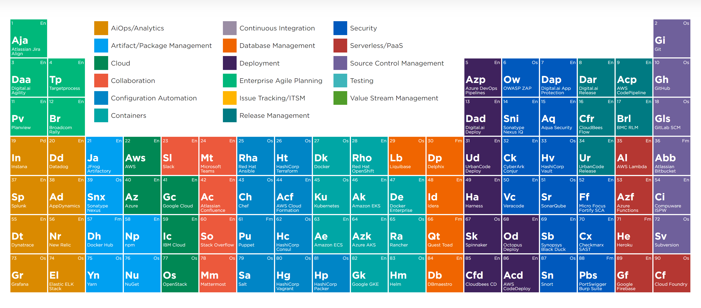

# DevOps

> More than development and operations. It's continuous value delivery.

> Culture of shared responsibility

**DevOps is**
* A mindset
* A culture
* A set of technical practices

This mainly leads to the fact that different "businesses or teams" need to work together (dev, test, business, ops, UX, ... )

**Goal**
* Business with fast the ability to adapt fast to the customers needs are more successful
* Built the right thing
* Get feedback fast
* It's about the product and not about the project. It's about the outcome not the output
	* We don't want to maximize the number of features (stuff) delivered but we want to solve the problems of our customers

**This can be achieved by**
* Shift left => get feedback earlier in the process. Once it reaches the development phase it should be clear and fast to release
* Reduce lead time
	* Reduce the time from "business ideas and features" to release of such features.
	* This means also to reduce the lead time of single tasks (reduce the waiting time). Examples here is the manual testing before the deployment (roughly 1 week)
* Built in quality
	* This gives us confidence to deploy and release often and with high probability of success
	* Lots of stories go back to the development phase. This needs to be reduced.
	* Increase automated tests (incl. security, L&P, E2E, tests for other non-functional requirements)
* Involve the business more and earlier
* Set hypothesis, measure it and learn from it

**Tools**

[digital.ai](https://digital.ai/learn/devops-periodic-table/)