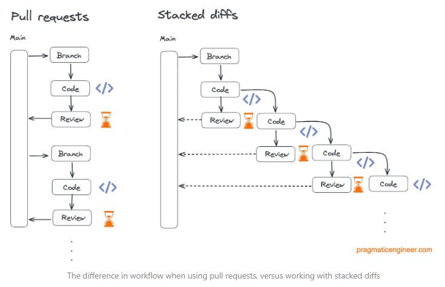
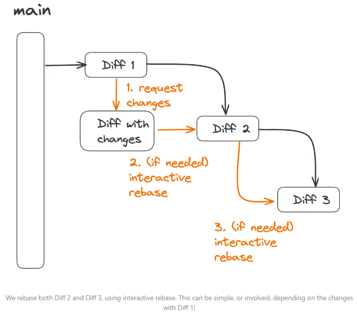
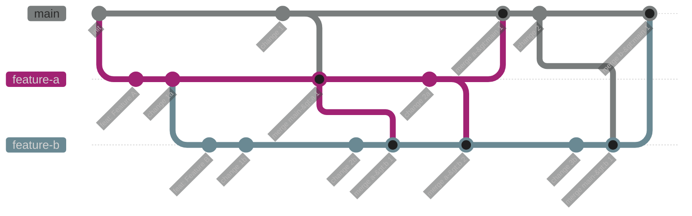
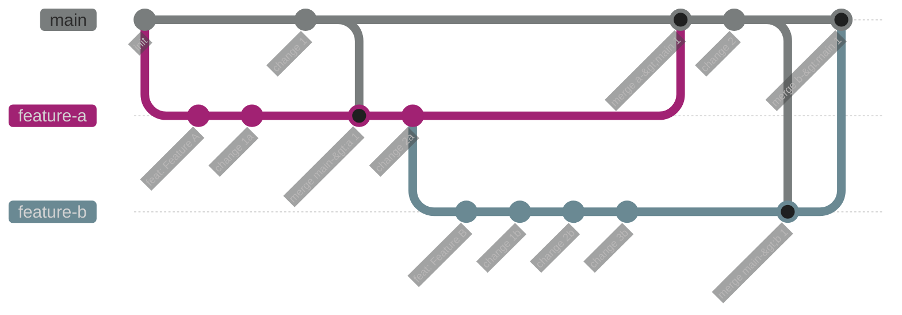
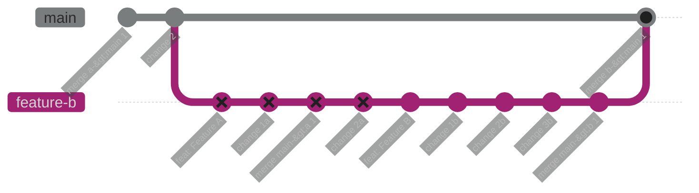

---
tags:
  - git
---

# Stacked Diffs / Stacked PR

For larger features you often have to wait long for PR reviews. Stacked diffs address this issue to reduce waiting time for PR reviews.
The main idea behind "**stacked diffs**" is a development workflow that involves breaking down large features into smaller, manageable units called "diffs" or "change sets" and stacking them on top of each other.  
This is mainly achieved by creating **small, self-contained changes that builds upon the change before it**. This contrasts with the traditional model where large changes are reviewed in a single, monolithic pull request.
 

The main difficulty with this approach arises when changes in the parent PR occur (e.g. PR feedback). Those changes often produce merge conflicts which propagate through all child branches. This issue can be mitigated with *interactive rebase*.
Do an interactive rebase on main but remove all commits from the first Diff (e.g. Diff 1)



**Example:**
```git
git checkout main
git pull
git checkout feature-b
git rebase -i main
```

Without rebasing:

With correct `rebasing` of *feature-b*  onto *feature-a*  we should have a cleaner history and no "merge a->b" commits.

With `interactive rebase` of *main*  we  should get rid of the crosses (❌) :


Tools to support stacked diffs

- Phabricator
- Graphite

# git-worktree

> A git repository can support multiple working trees, allowing you to check out more than one branch at a time.

See: https://git-scm.com/docs/git-worktree

# Gitflow

The key premise of Gitflow is that each commit to your primary branch (main) represents a release and a secondary branch, develop, is used for ongoing development. New features are built on feature branches and then reviewed and merged into the develop branch. When changes are ready to be released, a release branch is created, and when the release is complete that branch is merged into the primary branch.

Gitflow is most effective for teams that follow an extensive release management process that prevents continuous deployment, particularly if multiple stakeholders need to approve a release before it goes live. The release branch acts as a gatekeeper.

It however no longer alignes with the modern, continuous delivery based development.

# Trunk Based Development (TBD)

In trunk based development, developers merge small, frequent updates to the primary or "trunk" branch. Idiomatic trunk based development has developers committing directly to the primary branch, however it is common for teams to use short lived feature branches to support code reviews and automated checks prior to merging, this variant can sometimes be referred to as scaled trunk based development or feature branch workflow. Releases are done directly from the primary branch and since you are already deploying on all commits to the primary branch, fixes to deployed code is treated no different from any other code change.

This workflow is ideal for teams that utilise continuous deployment

There are no long living branches (especially: develop, release, features, hotfix). Everything gets directly merged to the main branch and needs therefore to be release ready. Trunk Based Development allows true [Continuous Integration](continuous-integration.md).