# Obsidian
On this page I test Obsidian features. Some might work, some wont. Above this title we have some font matter properties

## Inline


## Links

[misc](misc.md)
[ngrx-push](../frontend/js/ngrx-push.md)

## Callout

> [!info]
> This callout will get converted to the mkdocs admonition format (see note below) by the mkdocs-callouts plugin


> [!tip] Just Another Callout
> Wow


!!! note
    Callouts (see above) will get converted to this format (mkdocs admonition) by the mkdocs-callouts plugin


## PlantUML

```plantuml
@startuml C4_Elements
!include https://raw.githubusercontent.com/plantuml-stdlib/C4-PlantUML/master/C4_Container.puml

Person(personAlias, "Label", "Optional Description")
Container(containerAlias, "Label", "Technology", "Optional Description")
System(systemAlias, "Label", "Optional Description")

Rel(personAlias, containerAlias, "Label", "Optional Technology")
@enduml
```

## Draw.io Plugin

Within table

| sketchy style | non-sketchy style |
| - | - |
|     |  |

## Tags

#PKM #obsidian 